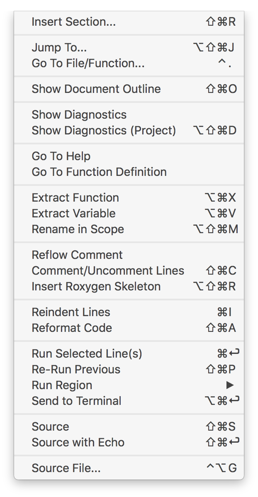
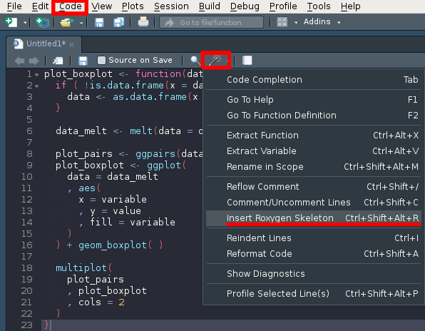

```{r setup, include=FALSE}
options(htmltools.dir.version = FALSE)
knitr::opts_chunk$set(echo = FALSE, fig.align = "center", dev = "svg")
```

class: center, middle, inverse


# 1. R coding style


---

## Names and structure

### File names

```{r, eval=FALSE, echo=TRUE}
# Good
fit_models.R
utility_functions.R

# Bad
fit models.R
foo.r
stuff.r
```

### Structure of the script


```{r, eval=FALSE, echo=TRUE}
# Load data ---------------------------

# Plot data ---------------------------
```


---

## Syntax

### Object names

Strive for names that are concise and meaningful.

```{r, eval=FALSE, echo=TRUE}
# Good
day_one
day_1

# Bad
first_day_of_the_month
DayOne
dayone
djm1
```

Avoid using already existing names.

```{r, eval=FALSE, echo=TRUE}
# Bad
T <- FALSE
c <- 10
mean <- function(x) sum(x)
```


---

## Spacing

Any style guide is fundamentally opinionated...

```{r, eval=FALSE, echo=TRUE}
# Good Hadley
average <- mean((feet / 12) + inches, na.rm = TRUE)
sqrt(x^2 + y^2)
x <- 1:10
base::get

# Good Alexis
average <- mean(
  ( feet / 12 ) + inches 
  , na.rm = TRUE
)
sqrt( x^2 + y^2 )
x <- 1:10
base::get

# Bad
average<-mean(feet/12 + inches,na.rm=TRUE)
sqrt(x ^ 2 + y ^ 2)
x <- 1 : 10
base :: get
```

---

## Indenting

```{r, eval=FALSE, echo=TRUE}
# Good
if (y < 0 && debug) {
  message("y is negative")
}

# Bad
if (y < 0 && debug)
  message("Y is negative")
```

---

## Long lines

Strive to limit your code to 80 characters per line.

```{r, eval=FALSE, echo=TRUE}
# Good
do_something_very_complicated(
  something = "that",
  requires = many,
  arguments = "some of which may be long"
)

# Bad
do_something_very_complicated("that", requires, many, arguments,
                              "some of which may be long"
)
```

---

### Assignment

```{r, eval=FALSE, echo=TRUE}
# Good
x <- 5

# Bad
x = 5 
```

---

## Automatic styling

You can use `Ctrl + Shift + A` or `Command + Shift + A` or 

*Rstudio > Code > Reformat code*

```{r, out.width="20%"}

```

Or `lintr`, `styler`, `prettycode` packages

```{r, eval=FALSE, echo=TRUE}
install.packages(c("lintr", "styler", "prettycode"))
library("lintr")
library("styler")
```

---

### lintr package

lintr can be used o a source file, eg `bad_style.R` being the following source:

```{r, eval=FALSE, echo=TRUE}
# Spacing 
average<-mean(feet/12 + inches,na.rm=TRUE)
sqrt(x ^ 2 + y ^ 2)
x <- 1 : 10
base :: get

# Indenting
if (y < 0 && debug)
  message("Y is negative")

# Assignment
x = 5
```

Then run

```{r, eval=FALSE, echo=TRUE}
lint("bad_style.R")
```


---

### lintr package

```{r, out.width="90%"}
knitr::include_graphics("https://camo.githubusercontent.com/20dbcc29a25f1e86dcde02d2056508c322f6ae05/687474703a2f2f692e696d6775722e636f6d2f50494b6e70626e2e706e67")
```


---

### styler package

```{r, out.width="100%"}
knitr::include_graphics("https://raw.githubusercontent.com/lorenzwalthert/some_raw_data/master/styler_0.1.gif")
```

---

### styler package

You can use the `style_text()` function as follows

```{r, eval=FALSE, echo=TRUE}
ugly_code <- "a<-function( x){1+1}           "
style_text(ugly_code)
```


```{r, eval=FALSE, echo=TRUE}
# Bad
a<-function( x){1+1}

# Good
a <- function(x) {
  1 + 1
}
```


---

### styler package

As well as the following variants of `style_text()`:

* `style_file()` styles .R and/or .Rmd files.
* `style_dir()` styles all .R files in a directory.
* `style_pkg()` styles the source files of an R package.
* RStudio Addins for styling the active file, styling the current package and styling the highlighted code region.

---

## Other tidying packages

**Get automatic advice about your package**

Install and run `goodpractice` package for *Advice (that) includes functions and syntax to avoid, package structure, code complexity, code formatting, etc.*

!!Not working anymore!!

**Remove typos!**

Use the `devtools::spell_check()` function. 

---

## References

To complete:
* http://style.tidyverse.org/
* https://cran.r-project.org/web/packages/rockchalk/vignettes/Rstyle.pdf
* https://journal.r-project.org/archive/2012-2/RJournal_2012-2_Baaaath.pdf
* https://cran.r-project.org/doc/manuals/R-ints.html
* https://google.github.io/styleguide/Rguide.xml
* https://www.r-project.org/conferences/useR-2004/Keynotes/Maechler.pdf
* https://stat.ethz.ch/Teaching/maechler/R/useR_2014/Maechler-2014-pr.pdf
* http://andrewgelman.com/2007/09/18/style_guide_for/
* http://blog.jom.link/ten_rules_reproductible_research.html

---

class: center, middle, inverse

# 2. Create R packages

---

## System settings - Customization of R profile

Create a R profile file `.Rprofile` with the path to your local
library if you use local libraries into your code, e.g :

```{r, eval=FALSE, echo=TRUE}
  .libPaths(new="~/R_libs")
```

See
http://gettinggeneticsdone.blogspot.com/2013/06/customize-rprofile.html
for more informations. 

---

## Package skeleton

Create a directory with the name of your package, e.g. `MyPackage`,
with inside:
* the sub-directory `R` for the R source code
* the file `DESCRIPTION` for meta-informations on your package.

```{r, eval=FALSE, echo=TRUE}
dir.create(
    path = "MyPackage" )
dir.create(
    path = paste(
        "MyPackage"
      , "R"
      , sep = .Platform$file.sep ) )
file.create(
    path = paste(
        "MyPackage"
      , "DESCRIPTION"
      , sep = .Platform$file.sep ) )
```    

---

### DESCRIPTION file

```{r, eval=FALSE, echo=TRUE}
cat( c(
    "Package: MyPackage"
  , "Version: 0.1"
  , "Date: 2018-02-08"
  , "Type: Package"
  , "Title: My nice package"
  , "Author: M. Richard"
  , "Maintainer: M. Richard <magali.richard@univ-grenoble-alpes.fr>"
  , "Description: Basic package to simulate a bedfile."
  , "License: CeCILL"
  , "URL: https://github.com/jarbel/Rgoodpractice.git" )
  , file = paste(
        "MyPackage"
      , "DESCRIPTION"
      , sep = .Platform$file.sep )
  , sep = "\n"
  , append = TRUE )
```


---

## R code documentation

Use the Roxygen templates to start the documentation:
```{r, out.width="75%"}

```

---

## R code documentation

And fill the Roxygen fields in order to best describe your function:
* Title of the function
* @description Some description
* @param <parameter name> name of each parameter and a short description (type, default value ...)
* @return value of the function output
* @author author of the function
* @seealso link to other functions or packages, e.g. \code{ \link[GGally]{ggpairs} } 
* @keywords some keywords for the code indexation
* @examples one or several examples on how to use the function
* @importFrom <package name> <function name> to import some package or functions during the installation and the loading of the function
* @export

---

### R code files


```{r, eval=TRUE, echo=TRUE}
cat( c(
 "#---------------------------------------------
  #'Generate simulated dataset.
  #'
  #'A bedfile (gene information).
  #'
  #' @param n_genes A number of genes to simulate
  #'
  #'@export
  generate_fakestudy <- function(n_genes) {
  start = unique(round(stats::runif(n_genes)*1000000))
  gene_list = data.frame(chr='chr1',
                         start =start,
                         stop = start + round(abs(stats:: rnorm(length(start)) * 10000)),
                         gene_id='gene',
                         score = 'NA',
                         strand = ifelse(stats::runif(length(start))>0.5, '+', '-'),
                         ref_genome='simu',
                         stringsAsFactors=FALSE)
  gene_list$gene_id = paste0('gene_', 1:length(start))
  rownames(gene_list) = gene_list$gene_id
  utils::head(gene_list)
  dim(gene_list)
  return(gene_list)
  }" )
  , file = "MyPackage/R/simulation.R"
  , sep = "\n"
  , append = TRUE )
```


---

## Package construction

With devtools:

[devtools package](https://github.com/r-lib/devtools)

[good practices](http://r-pkgs.had.co.nz/intro.html)

```{r, eval=FALSE, echo=TRUE}
#install.packages("devtools")
devtools::document("MyPackage/")
devtools::check("MyPackage/")
devtools::install("MyPackage/")
```

---

## Test

```{r, eval=TRUE, echo=TRUE}
n_genes <- 500

simus = MyPackage::generate_fakestudy(n_genes)
head(simus)
dim(simus)
```


---

## References

To complete:
* https://cran.r-project.org/doc/contrib/Leisch-CreatingPackages.pdf
* http://kbroman.org/pkg_primer/
* https://github.com/klutometis/roxygen
* http://r-pkgs.had.co.nz/
* https://support.rstudio.com/hc/en-us/articles/200486488-Developing-Packages-with-RStudio
* https://www.r-bloggers.com/how-to-write-and-debug-an-r-function/
* https://nicercode.github.io/guides/functions/
* https://swcarpentry.github.io/r-novice-inflammation/06-best-practices-R/

---

class: center, middle, inverse

# Thanks!

<br>

Presentation available at

https://jarbel.github.io/Rgoodpractice/rpresentation.html

<br>

http://www.julyanarbel.com/ & http://mistis.inrialpes.fr/people/arnaud/

Twitter: [@julyanarbel](https://twitter.com/julyanarbel)

GitHub: [@jarbel](https://github.com/jarbel) & [@A-Alexis](https://github.com/A-Alexis)

.footnote[Slides created via the R package [**xaringan**](https://github.com/yihui/xaringan).]
